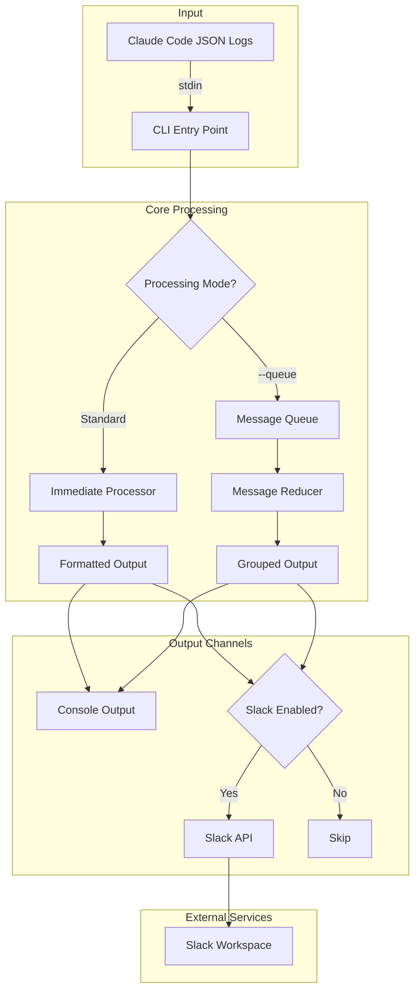
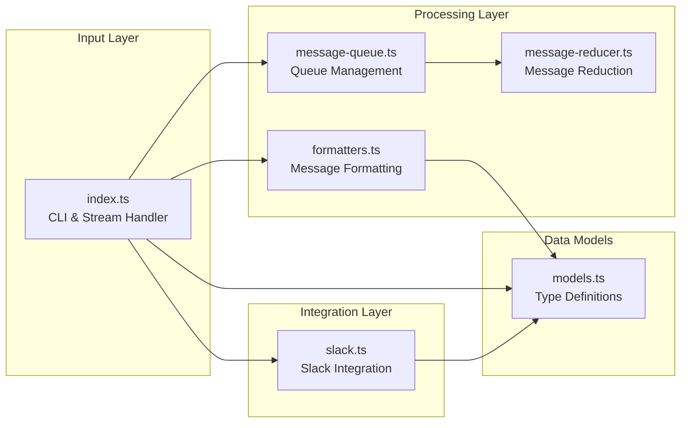
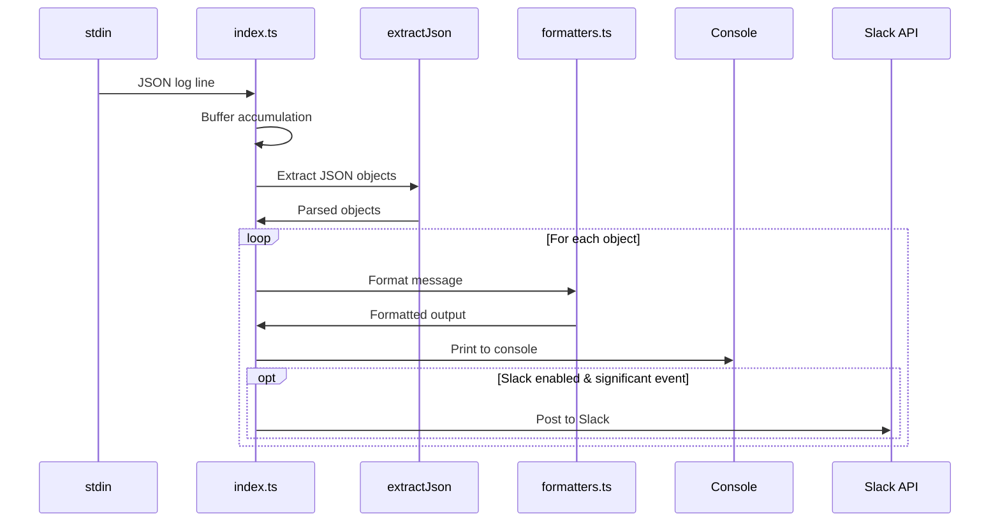
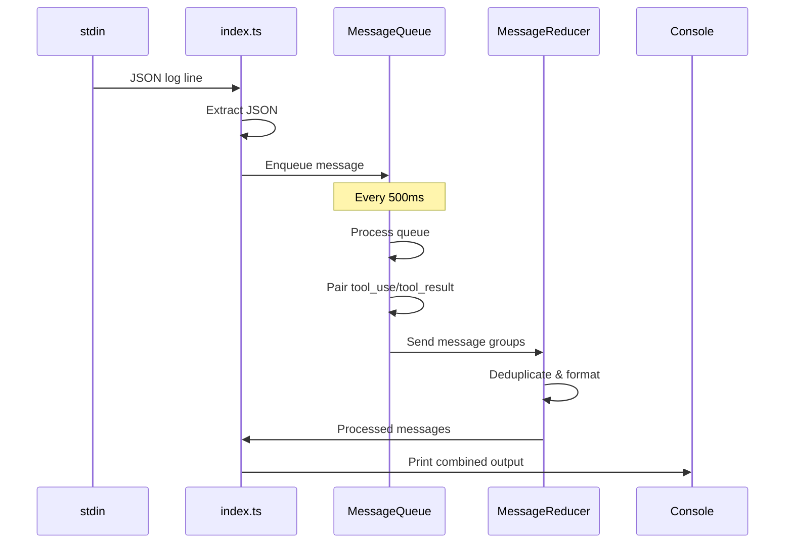
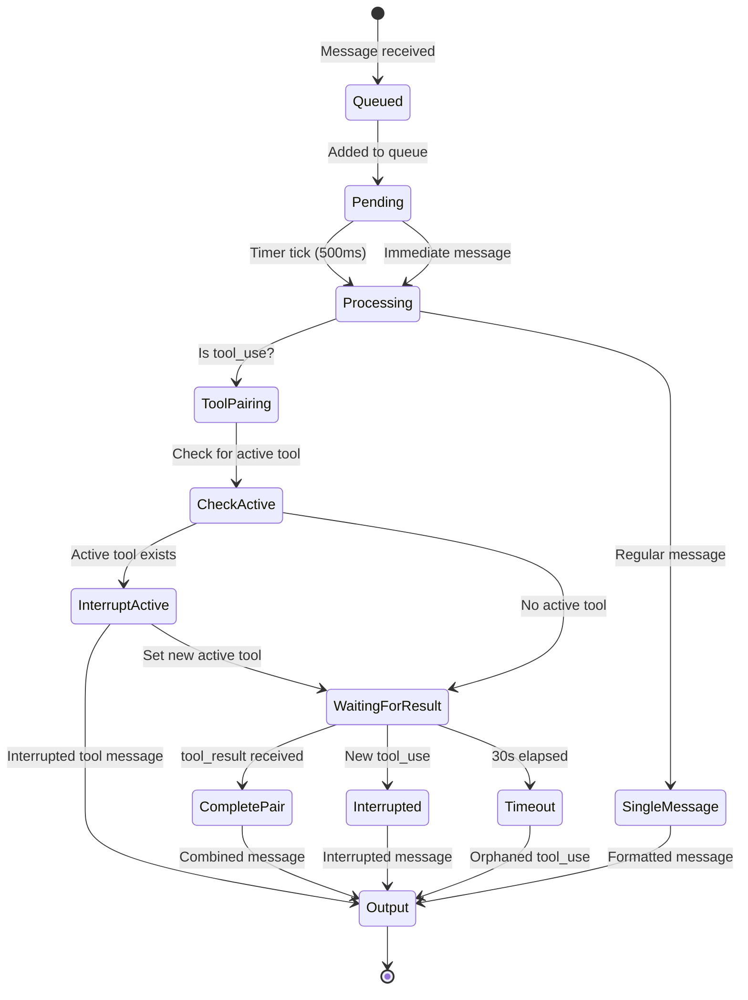
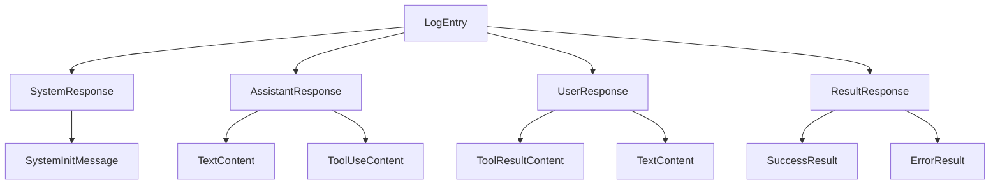
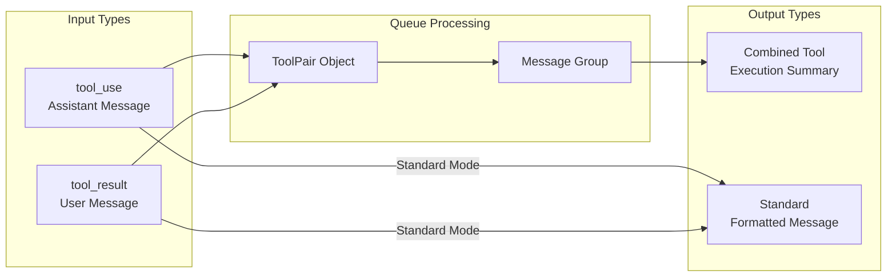
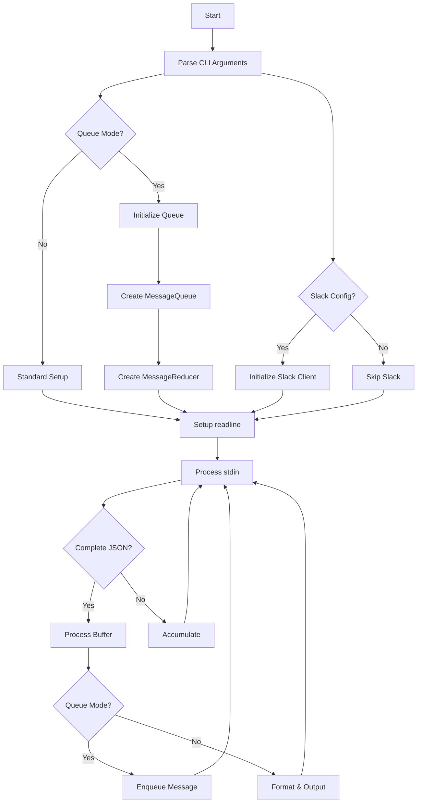
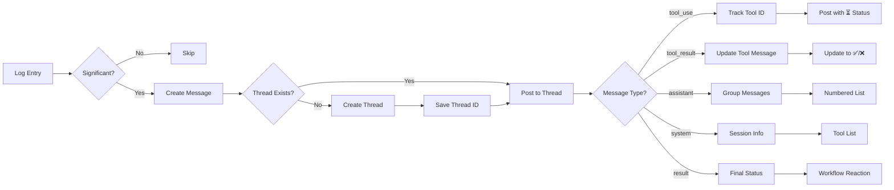

# ccpretty Architecture Documentation

## Overview

ccpretty is a command-line tool that transforms JSON log lines from Claude Code sessions into human-readable, colored output. It supports two processing modes: immediate (default) and queue-based (experimental), along with optional Slack integration for real-time notifications.

## Table of Contents

1. [System Architecture](#system-architecture)
2. [Core Components](#core-components)
3. [Data Flow](#data-flow)
4. [Processing Modes](#processing-modes)
5. [Message Types](#message-types)
6. [Component Details](#component-details)
7. [Integration Points](#integration-points)

## System Architecture



## Core Components

### Component Overview



### Component Responsibilities

| Component | Responsibility | Key Functions |
|-----------|---------------|---------------|
| `index.ts` | CLI entry point, stream processing, mode selection | `main()`, `processJsonBuffer()` |
| `models.ts` | TypeScript interfaces for Claude Code messages | Type guards, interfaces |
| `formatters.ts` | Visual formatting with colors and boxes | `formatAssistantResponse()`, etc. |
| `message-queue.ts` | Queue management and tool pairing | `enqueue()`, `processQueue()` |
| `message-reducer.ts` | Message deduplication and grouping | `reduceGroups()`, `reduceToolPair()` |
| `slack.ts` | Slack API integration | `postToSlack()`, `createSlackBlocks()` |

## Data Flow

### Standard Mode Data Flow



### Queue Mode Data Flow



## Processing Modes

### Standard Mode (Default)

- **Immediate processing**: Messages are formatted and output as soon as they're received
- **No buffering**: Each message is independent
- **Simple and fast**: Minimal latency between input and output
- **Tool separation**: `tool_use` and `tool_result` appear as separate messages

### Queue Mode (--queue flag)

- **Batched processing**: Messages are queued and processed every 500ms
- **Tool pairing**: Automatically matches `tool_use` with corresponding `tool_result`
- **Sequential tool execution**: Only one tool can run at a time - new tools interrupt previous ones
- **Interruption handling**: Interrupted tools are marked and displayed appropriately
- **Deduplication**: Filters out identical consecutive messages
- **Enhanced UX**: Shows complete tool execution workflows
- **Immediate messages**: System and result messages bypass queue for instant output
- **Orphan detection**: Tool uses without results after 30s are marked as orphaned



## Message Types

### Message Type Hierarchy



### Message Type Transformations



## Component Details

### index.ts - CLI Entry Point



### message-queue.ts - Queue Management

Key concepts:
- **QueuedMessage**: Wrapper for log entries with metadata (status, timestamp)
- **ToolPair**: Links tool_use with tool_result, tracks execution time
- **MessageGroup**: Collection of related messages for batch processing
- **Sampling**: Periodic processing every 500ms for better UX
- **Timeout handling**: 30s timeout for orphaned tool uses
- **Active tool tracking**: Only one tool can be active at a time
- **Interruption mechanism**: New tool uses interrupt pending ones

### message-reducer.ts - Message Processing

Key concepts:
- **Deduplication**: Tracks last output to avoid duplicates using content hashing
- **Tool combination**: Merges tool execution into single message with timing
- **Formatting**: Creates unified output with status indicators (✅, ❌, ⚠️)
- **Result truncation**: Limits output to 500 lines for readability
- **Error handling**: Special formatting for tool errors and interruptions
- **State management**: Maintains last message state for deduplication

### slack.ts - Slack Integration



Key features:
- **Rich formatting**: Uses Slack Block Kit for structured messages
- **Live updates**: Tool status changes from ⏳ to ✅/❌ on completion
- **Message grouping**: Consecutive assistant messages become numbered lists
- **Deduplication**: Skips identical messages to reduce noise
- **Thread management**: Saves/loads thread IDs for continuity
- **Workflow tracking**: Reactions on initial message show overall status

## Integration Points

### Environment Variables

| Variable | Purpose | Required |
|----------|---------|----------|
| `CCPRETTY_SLACK_TOKEN` | Bot token for Slack API | No |
| `CCPRETTY_SLACK_CHANNEL` | Target Slack channel | No |
| `CCPRETTY_SLACK_THREAD_TS` | Existing thread timestamp | No |

### CLI Arguments

| Argument | Purpose | Default |
|----------|---------|---------|
| `--queue` | Enable queue-based processing | Disabled |
| `--resume-slack-thread` | Resume last Slack thread | New thread |

### Input/Output Formats

**Input**: Newline-delimited JSON from Claude Code
```json
{"type":"assistant","message":{...},"session_id":"..."}
{"type":"user","message":{...},"session_id":"..."}
```

**Output**: Formatted text with ANSI colors and Unicode boxes
```
╔════════════════════════ assistant ════════════════════════╗
║                                                            ║
║   Hello! I'll help you with that task.                    ║
║   [claude-3-5-sonnet | 15 tokens | 120ms]                 ║
║                                                            ║
╚════════════════════════════════════════════════════════════╝
```

## Future Enhancements

1. **Configurable queue intervals**: Allow customization of the 500ms sampling rate
2. **Parallel tool execution**: Support for concurrent tool runs when safe
3. **Plugin architecture**: Support for custom formatters and processors
4. **Persistent state**: Save and resume sessions across restarts
5. **WebSocket support**: Real-time streaming to web interfaces
6. **Advanced filtering**: User-defined rules for message processing
7. **Export formats**: Support for Markdown, HTML, or JSON output
8. **Performance metrics**: Track and display queue processing statistics