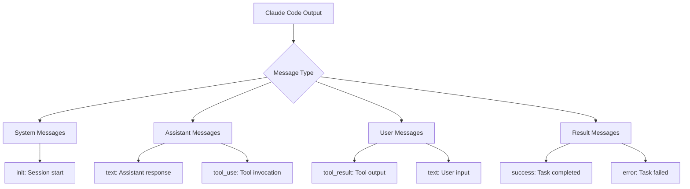
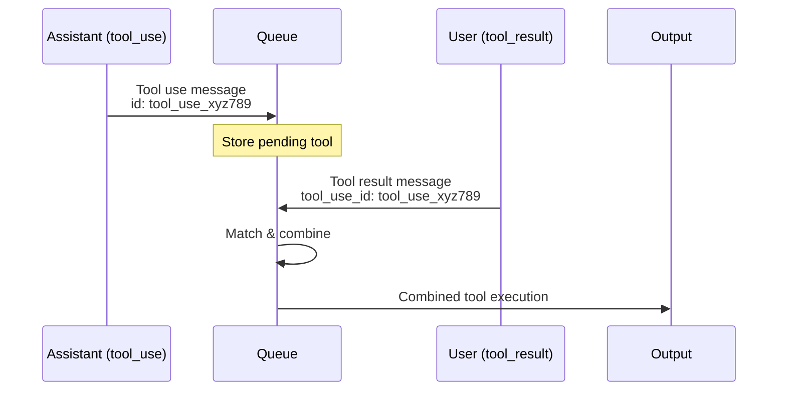
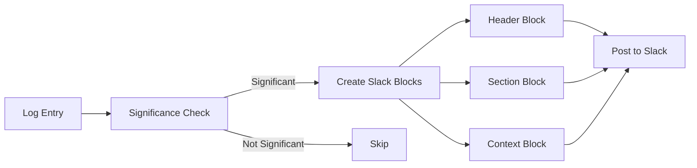

# Message Format Specification

This document details the JSON message formats that ccpretty processes from Claude Code logs.

## Message Type Overview



## Message Formats

### System Messages

#### Session Initialization
```json
{
  "type": "system",
  "subtype": "init",
  "session_id": "session_abc123",
  "tools": ["Bash", "Read", "Write", "Edit"],
  "mcp_servers": []
}
```

**Formatted Output:**
```
╔════════════════════════ system ════════════════════════╗
║                                                        ║
║   🚀 Session Initialized                               ║
║                                                        ║
║   Session ID: session_abc123                           ║
║   Available tools: Bash, Read, Write, Edit             ║
║                                                        ║
╚════════════════════════════════════════════════════════╝
```

### Assistant Messages

#### Text Response
```json
{
  "type": "assistant",
  "message": {
    "id": "msg_123",
    "type": "message",
    "role": "assistant",
    "model": "claude-3-5-sonnet-20241022",
    "content": [{
      "type": "text",
      "text": "I'll help you with that task."
    }],
    "stop_reason": "end_turn",
    "stop_sequence": null,
    "usage": {
      "input_tokens": 150,
      "output_tokens": 25
    },
    "ttftMs": 120
  },
  "session_id": "session_abc123"
}
```

#### Tool Use
```json
{
  "type": "assistant",
  "message": {
    "id": "msg_124",
    "type": "message",
    "role": "assistant",
    "model": "claude-3-5-sonnet-20241022",
    "content": [{
      "type": "tool_use",
      "id": "tool_use_xyz789",
      "name": "Bash",
      "input": {
        "command": "ls -la",
        "description": "List directory contents"
      }
    }],
    "stop_reason": "tool_use",
    "usage": {
      "input_tokens": 200,
      "output_tokens": 50
    },
    "ttftMs": 150
  },
  "session_id": "session_abc123"
}
```

### User Messages

#### Tool Result
```json
{
  "type": "user",
  "message": {
    "role": "user",
    "content": [{
      "type": "tool_result",
      "tool_use_id": "tool_use_xyz789",
      "content": "total 24\ndrwxr-xr-x  6 user  staff   192 Jan  1 12:00 .\ndrwxr-xr-x  5 user  staff   160 Jan  1 11:00 ..",
      "is_error": false
    }]
  },
  "session_id": "session_abc123"
}
```

### Result Messages

#### Success
```json
{
  "type": "result",
  "subtype": "success",
  "is_error": false,
  "result": "Task completed successfully",
  "duration_ms": 15000,
  "duration_api_ms": 5000,
  "num_turns": 5,
  "cost_usd": 0.0234
}
```

#### Error
```json
{
  "type": "result",
  "subtype": "error",
  "is_error": true,
  "error": "Task failed: Permission denied",
  "duration_ms": 3000,
  "duration_api_ms": 1000,
  "num_turns": 2,
  "cost_usd": 0.0045
}
```

## Queue Mode Transformations

### Tool Execution Pairing



**Input Messages:**
1. Assistant tool_use (Bash command)
2. User tool_result (command output)

**Queue Mode Output:**
```
╔═════════════════════════ tool ═════════════════════════╗
║                                                        ║
║  ✅ Tool: Bash - COMPLETED (0.75s)                     ║
║  🔧 Command: ls -la                                    ║
║  📝 Description: List directory contents               ║
║                                                        ║
║  📄 Result: total 24                                   ║
║  drwxr-xr-x  6 user  staff   192 Jan  1 12:00 .       ║
║  drwxr-xr-x  5 user  staff   160 Jan  1 11:00 ..      ║
║                                                        ║
╚════════════════════════════════════════════════════════╝
```

## Special Formatting

### TodoWrite Tool

The TodoWrite tool receives special formatting to display task lists clearly:

```json
{
  "type": "tool_use",
  "name": "TodoWrite",
  "input": {
    "todos": [
      {
        "id": "1",
        "content": "Implement feature X",
        "status": "completed",
        "priority": "high"
      },
      {
        "id": "2",
        "content": "Write tests",
        "status": "in_progress",
        "priority": "medium"
      }
    ]
  }
}
```

**Formatted Output:**
```
📝 Todo List:

✅ [HIGH] Implement feature X
🔄 [MEDIUM] Write tests
```

## Error Handling

### Tool Errors

When a tool result indicates an error:

```json
{
  "type": "tool_result",
  "tool_use_id": "tool_use_abc",
  "content": "Error: Command not found: invalidcmd",
  "is_error": true
}
```

**Queue Mode Output:**
```
╔═════════════════════════ tool ═════════════════════════╗
║                                                        ║
║  ❌ Tool: Bash - FAILED (0.25s)                        ║
║  🔧 Command: invalidcmd                                ║
║                                                        ║
║  🚨 Error: Command not found: invalidcmd               ║
║                                                        ║
╚════════════════════════════════════════════════════════╝
```

## Tool Interruption (Queue Mode Only)

Since only one tool can run at a time, when a new tool starts while another is running, the previous tool is interrupted:

**Input Sequence:**
1. Assistant tool_use (Read file command)
2. Assistant tool_use (Bash command) - interrupts previous
3. User tool_result (Bash command output)

**Queue Mode Output:**
```
╔══════════════════════ interrupted ══════════════════════╗
║                                                          ║
║  ⚠️ Tool: Read - INTERRUPTED                            ║
║  📁 File: /path/to/file.txt                             ║
║                                                          ║
║  🚫 Tool execution was interrupted by a new tool request ║
║                                                          ║
╚══════════════════════════════════════════════════════════╝

╔═════════════════════════ tool ═════════════════════════╗
║                                                        ║
║  ✅ Tool: Bash - COMPLETED (0.45s)                     ║
║  🔧 Command: ls -la                                    ║
║                                                        ║
║  📄 Result: total 16                                   ║
║  drwxr-xr-x  4 user  staff   128 Jan  1 12:00 .       ║
║                                                        ║
╚════════════════════════════════════════════════════════╝
```

## Slack Message Formatting

When Slack integration is enabled, messages are transformed into Slack's Block Kit format:



### Slack Block Example

System initialization message becomes:

```json
{
  "blocks": [
    {
      "type": "header",
      "text": {
        "type": "plain_text",
        "text": "🚀 Claude Code Session Started"
      }
    },
    {
      "type": "section",
      "fields": [
        {
          "type": "mrkdwn",
          "text": "*Session ID:*\n`session_abc123`"
        },
        {
          "type": "mrkdwn",
          "text": "*Tools:*\nBash, Read, Write, Edit"
        }
      ]
    }
  ]
}
```